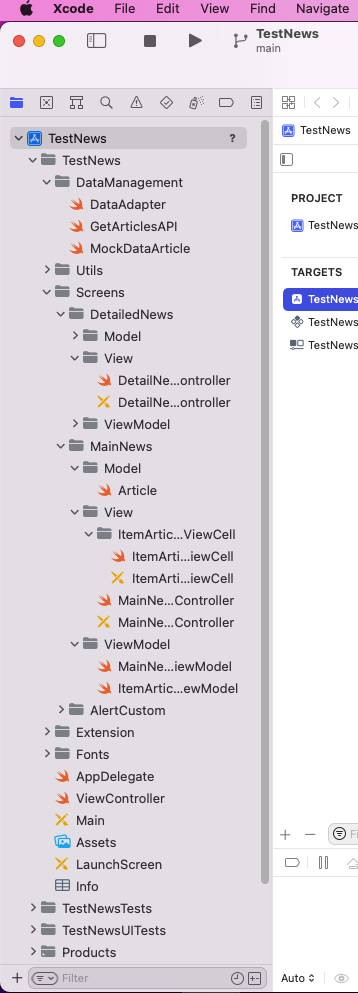

[![Swift Version][swift-image]][swift-url]
[![Build Status][travis-image]][travis-url]
[![License][license-image]][license-url]
[](https://github.com/Carthage/Carthage)
[](https://img.shields.io/cocoapods/v/LFAlertController.svg)  
[](http://cocoapods.org/pods/LFAlertController)
[](http://makeapullrequest.com)

# TestNews

<p align="row">

</p>

## Features

- [x] List Articles search by API
- [x] Search articles by name
- [x] Save and load local Data

## Software development princibles:

Follow by SOLID (define the protocol to init ViewController followed by MVVM structure)

## Structure:


- [x] TestLogic.playground: Test Logic Paty 1.
- [x] Utils: Some common functions.
        +Constant.swift: Store some constant
- [x] Font: Folder of font source
- [x] Service: Networking service.
        +RequestBuilder.swift, SessionBuilder.swift: Store some protocol to define the full api resful service.
        +Networkingable: The typealias of request and responsed file
        +When calling 1 api, we will define in Operation folder and implement BaseOperation<GenericModelType>, inside each file we have the method, parameters and the response type.
- [x] Screens: ViewController followed by MVVM.


    Model-View-ViewModel (MVVM) is a structural design pattern that separates objects into three distinct groups:

    - Models hold application data. They’re usually structs or simple classes.
    - Views display visual elements and controls on the screen. They’re typically subclasses of UIView.
    - View models transform model information into values that can be displayed on a view. They’re usually classes, so they can be passed around as references.
- [x] Extensions: Some extensions of classes.
- [x] TestNABWeatherTest: The Test of ViewModel
- [x] TestNABWeatherUITestsZ: The Test of UI

## Libraries in Pods:
[Kingfisher](https://github.com/onevcat/Kingfisher): Load uiimageview from online

[MBProgressHUD](https://github.com/jdg/MBProgressHUD): Show progress loading

[Alamofire](https://github.com/Alamofire/Alamofire): Load restfull API

[ESPullToRefresh](https://github.com/eggswift/pull-to-refresh): Pull to refresh of UITableView.

[IQKeyboardManagerSwift](https://github.com/hackiftekhar/IQKeyboardManager): handle keyboard event

## How to run this project

-  Download this project from develop branch and run, to change some config, go to setting screen from setting button in the top of uinavigation bar.
-  To check Error handle, change value from 30 to 0.1 in SessionBuilder file a below:
        config.timeoutIntervalForRequest = 0.1
        config.timeoutIntervalForResource = 0.1
        
## Checklist
        
- [x] Programming language: Swift is required, Objective-C is optional.
- [x] Design app's architecture (recommend VIPER or MVP, MVVM but not mandatory)
- [x] UI should be looks like in attachment.
- [x] Write UnitTests
- [x] Acceptance Tests
- [x] Exception handling
- [x] Caching handling
- [x] Code Logic test


## Requirements

- iOS 11.0+
- Xcode 13

## Installation

#### CocoaPods
You can use [CocoaPods](http://cocoapods.org/) to install `YourLibrary` by adding it to your `Podfile`:

```ruby
platform :ios, '11.0'
use_frameworks!
pod 'YourLibrary'
```

To get the full benefits import `YourLibrary` wherever you import UIKit

``` swift
import UIKit
import YourLibrary
```
#### Carthage
Create a `Cartfile` that lists the framework and run `carthage update`. Follow the [instructions](https://github.com/Carthage/Carthage#if-youre-building-for-ios) to add `$(SRCROOT)/Carthage/Build/iOS/YourLibrary.framework` to an iOS project.

```
github "yourUsername/yourlibrary"
```
#### Manually
1. Download and drop ```YourLibrary.swift``` in your project.  
2. Congratulations!  

## Contribute

We would love you for the contribution of my code to be more clear in the future

## Meta

Your Name – [@TungPhan](https://www.facebook.com/tung.teotop/) – phanthanhtung.pt@gmail.com

[https://github.com/vuakungfuvt/TestNABWeather](https://github.com/vuakungfuvt/TestNABWeather)

[swift-image]:https://img.shields.io/badge/swift-3.0-orange.svg
[swift-url]: https://swift.org/
[license-image]: https://img.shields.io/badge/License-MIT-blue.svg
[license-url]: LICENSE
[travis-image]: https://img.shields.io/travis/dbader/node-datadog-metrics/master.svg?style=flat-square
[travis-url]: https://travis-ci.org/dbader/node-datadog-metrics
[codebeat-image]: https://codebeat.co/badges/c19b47ea-2f9d-45df-8458-b2d952fe9dad
[codebeat-url]: https://codebeat.co/projects/github-com-vsouza-awesomeios-com
